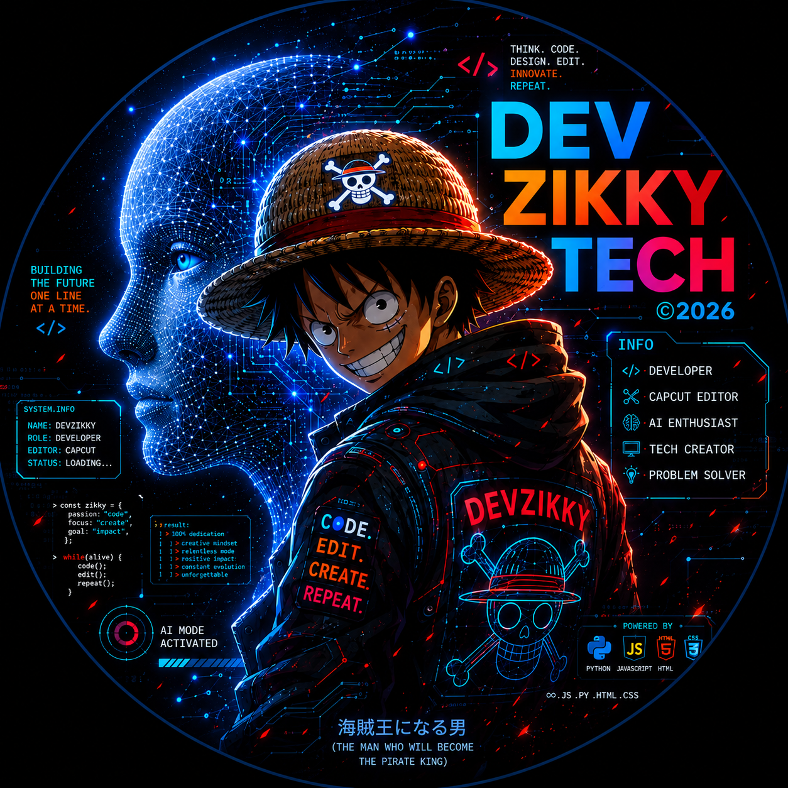
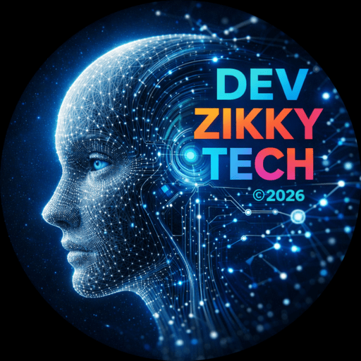

# DEVZIKKY TECH

**Software built with intent — projects, tools, APIs, AI, and bots, all in one place.**

[](https://zikkytech.xo.je)
[](https://zikkytech.xo.je#projects)
[](LICENSE)
[](https://github.com/zikky0001-droid/zikkytech)
[](https://github.com/zikky0001-droid/)

The complete catalogue of everything **DEV ZIKKY** builds — a lightweight static portfolio showcasing projects, tools, APIs, AI assistants, bots, and email infrastructure. No frameworks, no build step, no dependencies. Built by [DEV ZIKKY 🧑‍💻](https://zikkytech.xo.je).

---

<div align="center">

  <!-- Capsule -->
  

  <!-- Typing animation -->
  

  <!-- Badge row -->
  <p align="center">
    
    
    
    
  </p>

  <!-- Logo 1 -->
  <p align="center">
    <a href="https://zikkytech.xo.je">
      
    </a>
  </p>

</div>

---


<div align="center">

  <a href="https://git.io/typing-svg">
    
  </a>

  <!-- Logo 2 -->
  <p align="center">
    
  </p>

  <!-- Stats row -->
  <p>
    
    
    
    
  </p>

</div>


<br>

<div align="center">
  <a href="https://github.com/zikky0001-droid" target="_blank">
    
  </a>
  <a href="https://github.com/zikky0001-droid/zikkytech/fork">
    
  </a>
  <a href="https://github.com/zikky0001-droid/zikkytech/stargazers">
    
  </a>
</div>

<br>


---

## 🛠️ Built With


---

## 🚢 Deploy to Vercel

[](https://vercel.com/new/clone?repository-url=https://github.com/zikky0001-droid/zikkytech)

---

## ✨ Features

### For visitors
- **Complete project catalogue** — every public build, one place
- **Filterable grid** — AI, Email, Utility, Bots
- **Live preview modal** — click any card for a full screenshot
- **Real-time Lagos clock** — always shows current WAT time
- **Auto-updating age** — the bio increments on January 8 at 01:00 WAT, every year
- **Rotating hero headline** — *intent · purpose · curiosity · precision* and more
- **Dark glass aesthetic** — animated gradients, blurred panels, ambient glows
- **Zero setup for visitors** — no login, no tracking, no cookies
- **Mobile-first layout** — tested on phones, tablets, and desktops

### For developers
- **No frameworks** — plain HTML, CSS, JavaScript
- **No build step** — open `index.html` and it works
- **Static hosting friendly** — deploy to Vercel, Netlify, GitHub Pages, Cloudflare, anywhere
- **Design system** — CSS custom properties for all colours, spacing, radii
- **Responsive breakpoints** — `980px`, `760px`, `430px`
- **`prefers-reduced-motion` respected** — accessibility matters
- **Semantic HTML** — proper landmarks, ARIA labels, keyboard support
- **Clean JavaScript** — modular functions, escaped output, IntersectionObserver reveals
- **Custom 404 and error pages** included

---

## 🚀 Quick Start

### For visitors

1. Visit **[zikkytech.xo.je](https://zikkytech.xo.je)**
2. Scroll through the **Projects** section
3. Click any card to see a screenshot preview
4. Click **Visit project** to open the live deployment

### For developers

```bash
# Clone the repo
git clone https://github.com/zikky0001-droid/zikkytech.git
cd zikkytech

# Open locally (no install needed)
open index.html

# Or, if you want a local dev server
npx serve .
```

That's it. No npm install. No yarn build. No config files to edit.

---

📁 Project Structure

```
zikkytech/
├── index.html              # The complete portfolio (single page)
├── logo1.png               # Large Z mark — hero + favicon
├── logo2.png               # Badge-style icon — avatar
├── banner.svg              # Animated banner (README only)
├── ss-zquote.png           # Project screenshots
├── ss-zmail.png
├── ss-zmaildrop.png
├── ss-zdropmail.png
├── ss-ai.png
├── ss-ai2.png
├── ss-manga.png
├── ss-cal.png
├── ss-tg.png
├── ss-yt.png
├── LICENSE
└── README.md
```

One HTML file. Everything — CSS, JavaScript, project data, modals — lives inside index.html. There is no build step, no bundler, no dependency tree.

---

🌟 Projects Catalogue

The portfolio currently showcases these projects:

Project Type Link
ZQUOTE Quote image API zquote-tau.vercel.app
ZMAIL Studio Email sender API zmail.zone.id
ZMAIL Drop Public temp inbox zmaildrop.vercel.app
ZDROPMAIL Private temp inbox zdropmail.vercel.app
ZIKKY AI v1 AI assistant zikky-ai.xo.je
ZIKKY AI v2 AI assistant zikkyai.onrender.com
ZIKKY Manga Hub Manga reader zikkymangahub.onrender.com
ZIKKY Calculator Web utility zikkycal.netlify.app
ZIKKY Telegram Bot Bot t.me/zbot101bot
Phishing Edu Security awareness zikkyphishing.netlify.app
DEV-ZIKKY Pair Pair programming dev-zikky-pair.onrender.com
DEVZIKKY AI AI chat devzikky.onrender.com

Each project is a real, live deployment. Click any entry to open it.

---

🔥 The Projects, In Detail

🤖 ZIKKY AI — zikky-ai.xo.je

A free AI chat platform. Talk to capable models, get coding help, and use features like text-to-speech — all in one place. Powered by multi-model orchestration.

🧠 DEVZIKKY AI — devzikky.onrender.com

A developer-focused AI assistant. Dedicated interface for technical questions, debugging, programming help, and development workflows.

📧 ZMAIL Studio — zmail.zone.id

Where ZMAIL Drop receives, ZMAIL Studio sends. A workspace for crafting polished personal emails — 7 reusable templates, a rich editor, live preview, and a server-side sending API.

📬 ZMAIL Drop — zmaildrop.vercel.app

A public, name-based temporary mailbox service with a full REST API. No account, no password, no cost. Great for quick signups and developer testing.

📮 ZDROPMAIL — zdropmail.vercel.app

A separate, private temporary mailbox service with generated addresses and short lifetimes. Better than ZMAIL Drop when you don't want anyone guessing your address.

Why two inbox services? Different needs. ZMAIL Drop is fast, public, and name-based. ZDropMail is private, generated, and lifetime-bound.

💬 ZQUOTE — zquote-tau.vercel.app

A Telegram-style quote generator API. Send a username, message, and optional avatar — get back a rendered, shareable quote image hosted on a CDN. Includes a live preview tester and copy-paste examples for cURL, JavaScript, and Python.

📚 ZIKKY Manga Hub — zikkymangahub.onrender.com

A free manga reading site with a clean reader, downloads, and bookmarking — built for readers who want a premium feel without the paywalls.

🖩 ZIKKY Calculator — zikkycal.netlify.app

The first DEVZIKKY release (2025). A compact calculator with a Matrix-inspired visual identity.

💬 ZIKKY Telegram Bot — t.me/zbot101bot

A Telegram automation project combining utilities, AI, and bot workflows.

🎯 Phishing Edu — zikkyphishing.netlify.app

A security-awareness project for understanding phishing concepts through demonstration.

---

👨‍💻 About the Developer

DEV ZIKKY is a 16-year-old full-stack developer, builder, and problem-solver from Lagos, Nigeria. He builds tools that solve real problems — usually from a phone, in Termux, at odd hours. His work spans AI chat assistants, email infrastructure, manga readers, Telegram and WhatsApp bots, and cybersecurity awareness projects.

"Innovation is not about having all the answers — it's about asking the right questions."

Every project starts the same way: notice something annoying or missing, then build the fix. ZMAIL Drop, ZIKKY AI, Manga Hub, ZQUOTE, and ZMAIL Studio all began as personal needs that turned into public tools.

· 🌐 Portfolio: zikkytech.xo.je
· 💻 GitHub: @zikky0001-droid
· 📸 Instagram: @devzikky
· ✉️ Email: zikkystar0001@gmail.com

---

🤝 Collaborators

<!-- 
  ─────────────────────────────────────────────────────────────
  HOW TO EDIT THIS SECTION:

  Show up to 3 avatars below. If there are more than 3, replace
  "and N more" with the correct count. The GitHub contributors
  badge above auto-updates with the real total.

  Replace the placeholder avatars with real GitHub usernames:
    <a href="https://github.com/USERNAME"></a>
  ─────────────────────────────────────────────────────────────
-->

<p align="center">
  
</p>

<p align="center">
  <a href="https://github.com/zikky0001-droid" title="zikky0001-droid">
    
  </a>
  <!-- Replace the two placeholders below with real collaborators -->
  <a href="https://github.com/PLACEHOLDER-1" title="collaborator 2">
    
  </a>
  <a href="https://github.com/PLACEHOLDER-2" title="collaborator 3">
    
  </a>
</p>

<p align="center">
  <strong>zikky0001-droid</strong> and <strong>2 more</strong>
  <!--
    If there are only 3 total:   "zikky0001-droid and 2 more"
    If there are 5 total:         "zikky0001-droid and 4 more"
    If there is only 1:           "zikky0001-droid"
    Rule: show 3 avatars, text shows "(total - 1) more"
  -->
</p>

---

💖 Support the Project

DEVZIKKY TECH is free forever and runs on generosity. Every contribution helps pay for:

· Vercel hosting (serverless function invocations)
· Firebase Firestore reads/writes (rate limiting + stats)
· Custom domain renewals
· Coffee for late-night debugging sessions ☕

If any of these projects have been useful to you — whether for one signup or a hundred — consider supporting the work to keep it alive for everyone.

How to donate

Contact the developer directly to arrange a donation or sponsorship:

· 💬 GitHub: @zikky0001-droid
· 🌐 Portfolio: zikkytech.xo.je
· ✉️ Email: zikkystar0001@gmail.com

Contacting directly keeps costs low (no payment processor fees) and lets you ask questions, suggest features, or sponsor a specific project.

Not able to donate?

You can still help a lot:

· ⭐ Star the repo — signals it's worth maintaining
· 🐛 Report bugs — makes the projects better for everyone
· 📣 Share it with friends, forums, or developer communities
· 💡 Suggest features — many are built on user requests
· ✍️ Write about it — blog posts and mentions help visibility

---

🤝 Contributing

This project is open source and contributions are welcome.

```bash
# 1. Fork the repo
# 2. Create a feature branch
git checkout -b feature/my-improvement

# 3. Make your changes
# 4. Test locally
open index.html

# 5. Commit and push
git commit -m "Add my improvement"
git push origin feature/my-improvement

# 6. Open a Pull Request
```

Guidelines

· Keep the stack minimal — no frameworks, no build tools
· Maintain the visual identity — colours, fonts, glass cards
· Test on mobile before submitting — the site is mobile-first
· Update the project table if you add or change any entry
· Match the tone — clean, technical, honest

---

📜 License

MIT — see LICENSE for details.

You're free to fork, modify, self-host, and redistribute. Attribution is appreciated but not required.

---

🙏 Credits

Built and maintained by DEV ZIKKY — zikkytech.xo.je

· Design & code: DEV ZIKKY
· Organisation: DEV ZIKKY TECH
· Hosting: Vercel
· Fonts: Inter, Space Grotesk, IBM Plex Mono
· Icons: Font Awesome
· Animated banners: Capsule Render, Readme Typing SVG

---

📬 Contact & Links
```
Platform Link
🌐 Portfolio zikkytech.xo.je
💻 GitHub github.com/zikky0001-droid
🤖 DEVZIKKY AI devzikky.onrender.com
🧠 ZIKKY AI zikky-ai.xo.je
📧 ZMAIL Studio zmail.zone.id
📬 ZMAIL Drop zmaildrop.vercel.app
📮 ZDROPMAIL zdropmail.vercel.app
📚 Manga Hub zikkymangahub.onrender.com
💬 ZQUOTE zquote-tau.vercel.app
📸 Instagram @devzikky
✉️ Email zikkystar0001@gmail.com
```
---

<div align="center">

⭐ If DEVZIKKY TECH helped you, consider starring the repo or contacting the developer to support its upkeep.

DEVZIKKY TECH — Software built with intent.

Built with ☕ and 🌙 by DEV ZIKKY from Lagos, Nigeria 🇳🇬

</div>

---

<p align="center">
  <a href="https://git.io/typing-svg">
    
  </a>
</p>

<p align="center">
  
</p>


